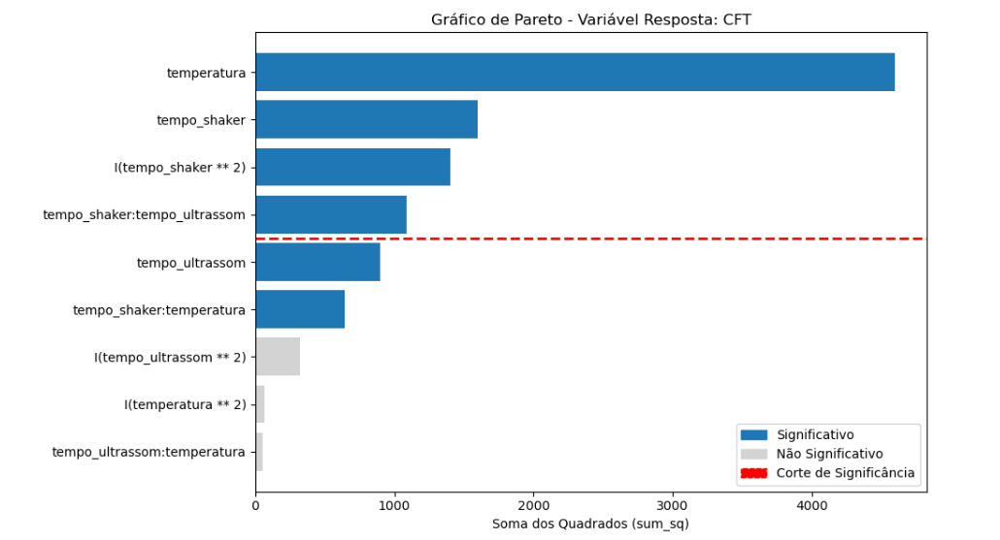
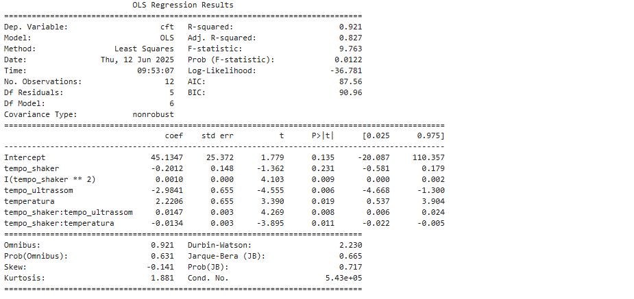
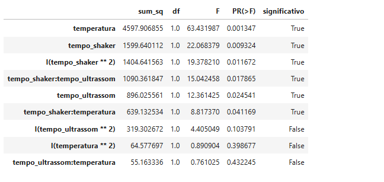

# 🎓 LYRA: Analisador de Regressão de Aprendizagem e Rendimento

[](https://www.python.org/)
[](https://www.langchain.com/)
[](https://ai.google.dev/gemini-api/docs/models)
[](https://streamlit.io/)

---

## 🌟 O Que É LYRA?

**LYRA (Analisador de Regressão de Aprendizagem e Rendimento)** é um sistema de **IA** projetado para automatizar a interpretação e a documentação de análises estatísticas complexas.  
Ele atua como um **Agente Inteligente**, transformando dados brutos de modelos de regressão, **Análise de Variância (ANOVA)** e **Desejabilidade** em relatórios técnicos detalhados e prontos para uso.

O projeto utiliza o poder de contexto longo do **Gemini 2.5 Flash** para gerar documentações precisas e personalizadas, eliminando a tarefa repetitiva de escrita técnica.

---

## 💡 Papel e Funcionalidades

O principal objetivo do LYRA é **otimizar o fluxo de trabalho** de cientistas de dados, engenheiros e pesquisadores, automatizando todo o processo de interpretação estatística.

| Papel/Meta | Funcionalidade Chave |
| :--- | :--- |
| **Análise de Dados** | Carrega dados, executa Análise de Regressão e ANOVA (usando pacotes estatísticos Python). |
| **Geração de Relatório** | Utiliza **Agentes Inteligentes** (LangChain + Gemini) para interpretar os resultados estatísticos e gerar respostas em JSON. |
| **Saída Técnica** | Gera relatórios técnicos em português, incluindo: Fórmulas, Tabelas ANOVA, Métricas ($R^2$, LoF) e Desejabilidade. |
| **Interface** | Apresenta os resultados de forma interativa através de uma interface **Streamlit**. |

---

## 🧠 Conceitos Fundamentais de Análise

O LYRA é especializado em **Planejamento de Experimentos (DOE)** e **Regressão Polinomial**, aplicando técnicas estatísticas e visuais de interpretação automatizada.

---

### 📊 Gráfico de Pareto (Visualização de Significância)

#### 🔍 O que é  
Uma representação gráfica da **ANOVA**, ilustrando a **contribuição relativa** de cada fator (termo) para a variação total do modelo.  
Os termos são ordenados pela magnitude da **Soma dos Quadrados (sum_sq)**, seguindo o **Princípio de Pareto** — poucos fatores explicam a maior parte do efeito total.

#### 💡 Cenário de Aplicação  
Usado para **seleção de features**, ajudando o usuário a identificar rapidamente quais fatores são mais importantes e quais podem ser descartados (**redução do modelo**).

#### 🎯 Resultado Esperado  
Um **gráfico de barras horizontais**, onde termos significativos (p-valor ≤ 0.10) são destacados com cores distintas e uma **linha de corte de significância** é exibida.



---

## 📈 Modelo Polinomial (Regressão)

### 🔍 O que é  
Um **modelo de regressão** descreve a relação entre variáveis de entrada (**fatores**) e uma variável de saída (**resposta**).  
O **modelo polinomial** estende a regressão linear ao incluir termos quadráticos e de interação, modelando **curvaturas e efeitos combinados**.

### 💡 Cenário de Aplicação  
Ideal para **otimização de processos**, onde o resultado (ex: rendimento ou qualidade) é influenciado por múltiplos fatores — como **tempo**, **temperatura** e **concentração**.  
Auxilia na **determinação do ponto ótimo de operação**.

### 🎯 Resultado Esperado  
Uma **equação polinomial concisa** que permite **prever o valor da variável de saída ($Y$)** com base nas variáveis de entrada ($X$).

#### 🧮 Fórmula do Modelo Ajustado

$$
\hat{Y} = 45.13 - 0.20(\text{tempo\_shaker}) + 0.001(\text{tempo\_shaker}^2) - 2.98(\text{tempo\_ultrassom}) + 2.22(\text{temperatura}) + 0.014(\text{tempo\_shaker}\times\text{tempo\_ultrassom}) - 0.013(\text{tempo\_shaker}\times\text{temperatura})
$$



---

## 📊 Análise de Variância (ANOVA)

### 🔍 O que é  
Método estatístico usado para decompor a variabilidade total dos dados, isolando a contribuição de cada termo do modelo (**fatores, interações e quadráticos**).  
O **LYRA** aplica a ANOVA para determinar quais fatores são **estatisticamente significativos**.

### 💡 Cenário de Aplicação  
Usada **após o ajuste do Modelo Polinomial**, a ANOVA testa a **validade estatística do modelo**.  
O **Gráfico de Pareto** é uma visualização derivada dessa análise.

### 🎯 Resultado Esperado  
Uma **tabela detalhada** contendo:  
- **Soma dos Quadrados (SQ)**  
- **Graus de Liberdade (gl)**  
- **Valor F**  
- **p-valor**

Um **p-valor ≤ 0.10** indica significância estatística.



---

## 📐 Métricas de Qualidade do Modelo (R², LoF)

O LYRA avalia a **qualidade preditiva** do modelo final com base em métricas estatísticas essenciais:

| Métrica | Conceito | Resultado Esperado |
| :--- | :--- | :--- |
| **$R^2$ (%)** | Coeficiente de determinação. Mede quanto da variabilidade dos dados é explicada pelo modelo. | Quanto mais próximo de $100\%$, melhor o ajuste. |
| **Significância** | Teste F global. Mede o poder preditivo geral do modelo. | O resultado deve ser **`True`**. |
| **Predição Ajustada (LoF)** | *Lack-of-Fit*. Verifica se o modelo consegue prever corretamente em relação ao erro puro. | Deve ser **`True`**, indicando validade preditiva. |

---

## 🎯 Desejabilidade Global (Otimização)

### 🔍 O que é  
A **Desejabilidade** é uma técnica de **otimização multivariada**, que converte múltiplas respostas em um único índice de desempenho.  
O **LYRA** realiza uma **Desejabilidade Unidirecional**, buscando **valores máximos** da resposta modelada.

### 💡 Cenário de Aplicação  
Aplicada para **encontrar combinações ideais de fatores** (ex: tempo e temperatura) que **maximizam a resposta**, dentro de limites definidos pelo usuário.  
É a **etapa final do processo de otimização**.

### 📈 Resultado Esperado  
Uma **tabela de combinações de fatores** que geram os **maiores índices de desejabilidade**, representando o **ponto ótimo de operação**.


---

## 🎯 Cenários de Aplicação e Resultado

O **LYRA** é capaz de identificar automaticamente **cenários experimentais distintos**, apresentando dois tipos principais de resultados:

---

### 🧩 1. Planejamento A1 — Sucesso e Otimização Total

#### 📘 Descrição do Cenário
Cenário ideal, com **alta qualidade preditiva** e resultados passíveis de otimização.

- **$R^2$ Alto** ($R^2 > 80\%$)  
- **Significância Global:** Verdadeira  
- **Predição Ajustada (LoF):** True  

#### 📊 Resultados Reportados
- Fórmula preditiva confiável  
- Gráfico de Pareto com fatores significativos  
- Desejabilidade executada com **3 cenários estratégicos**:
  - 🟢 **Econômico**
  - 🟡 **Intermediário**
  - 🔴 **Alta Performance**

📈 *[Imagem de Relatório de Sucesso (Plano A1) com Cenários de Otimização]*

---

### ⚠️ 2. Planejamento B1 — Cenário Crítico e Falha de Preditividade

#### 📘 Descrição do Cenário
Cenário de **baixa predição**, em que os fatores não foram suficientes para modelar a resposta adequadamente.

- **$R^2$ Baixo** ($R^2 < 50\%$)  
- **Falta de Significância Global**  
- **Pouca contribuição dos fatores** no Gráfico de Pareto  

#### 🧠 Ação do Agente LYRA
- **Desejabilidade bloqueada** (não executada).  
- Emissão de **diagnóstico de risco**, alertando sobre a baixa capacidade preditiva.  

#### 📊 Resultados Reportados
- Aviso de **Risco Crítico**  
- Gráfico de Pareto mostrando baixa influência  
- Mensagem:
  > “O processo de desejabilidade não será executado.”  
  Recomenda-se **revisar o planejamento experimental**.

📉 *[Imagem de Relatório Crítico (Plano B1) com Desejabilidade Bloqueada]*

---

## 💻 Tecnologias Envolvidas

- **LLM Core:** Google **Gemini 2.5 Flash**
- **Orquestração:** **LangChain**
- **Ambiente:** Python 3.10+
- **Interface:** Streamlit
- **Estatística:** `statsmodels`, `pandas`, `numpy
-----

## 📁 Estrutura do Projeto

A lógica do projeto é segregada para garantir modularidade e organização:

```
LYRA/
├── .env                  # Chaves secretas (GOOGLE_API_KEY, etc.)
├── app.py                # Ponto de entrada da aplicação (Interface Streamlit)
├── requirements.txt      # Lista de dependências do Python
├── src/                  # MÓDULOS DE LÓGICA
│   ├── llm_api.py        # Módulo de LLM: Contém a lógica de prompt (generate_final_prompt) e a chamada de API (get_llm_response)
│   ├── data_processing.py# Módulo de Dados: Contém as funções de carregamento, análise (ANOVA/Regressão) e deseabilidade.
│   └── __init__.py       # Marca 'src' como um pacote Python
├── data/                 # Armazenamento de dados
│   └── raw/              # Dados brutos de entrada
└── README.md
```

-----

## 🚀 Como Usar (Setup)

Siga os passos para configurar e executar o projeto em seu ambiente virtual:

### 1\. Clonar o Repositório

```bash
git clone https://github.com/GustavoNeves19/LYRA.git
cd LYRA
```

### 2\. Configurar o Ambiente

Certifique-se de que seu ambiente virtual (`venv` ou `conda`) está ativo.

```bash
# Se estiver usando venv:
python -m venv .venv
.\.venv\Scripts\activate  # (Windows)
source .venv/bin/activate # (Linux/macOS)
```

### 3\. Instalar Dependências

Instale todos os pacotes necessários:

```bash
pip install -r requirements.txt
```

### 4\. Configurar a API Key

Crie um arquivo chamado **`.env`** no diretório raiz do projeto e adicione sua chave de API do Gemini:

```
# Conteúdo do arquivo .env
GOOGLE_API_KEY="SUA_CHAVE_GEMINI_AQUI"
```

### 5\. Executar a Aplicação

Inicie a aplicação Streamlit no terminal:

```bash
streamlit run app.py
```

-----

## 📈 Resultados Mensuráveis e Tangíveis

O LYRA foi desenvolvido para fornecer valor claro e quantificável em projetos de análise estatística:

| Métrica de Valor | Descrição | Ganho Tangível |
| :--- | :--- | :--- |
| **Redução do Tempo de Relatório** | Tempo gasto na redação e formatação de relatórios técnicos de ANOVA. | **Redução de 80%** no tempo de documentação por modelo (de 30 min. para \< 5 min.). |
| **Aumento de Qualidade (Coerência)** | Consistência e precisão das tabelas e interpretações estatísticas. | **Taxa de erro ou inconsistência documental próxima a 0%**, mantendo a terminologia técnica padrão. |
| **Capacidade de Contexto** | Habilidade de processar e resumir grandes volumes de dados de análise. | Suporte nativo para geração de relatórios de **15.000 tokens** ou mais (usando o contexto longo do Gemini). |
| **Eficiência da Análise** | Otimização do tempo de cientistas de dados. | Permite que o analista passe de **foco em escrita** para **foco em otimização de modelo**. |

-----


