# 🎓 LYRA: Relatório Detalhado do Planejamento A1

Este documento apresenta a análise automatizada do **Planejamento A1** realizada pelo **LYRA (Analisador de Regressão de Aprendizagem e Rendimento)**. O objetivo é detalhar cada etapa do processo, desde o carregamento dos dados até a otimização final, utilizando as funcionalidades de IA do sistema.

## 🚀 Etapa 1: Carregamento e Identificação das Variáveis

A primeira etapa do processo no LYRA envolve o carregamento do arquivo de dados e a identificação automática das variáveis independentes (fatores) e dependentes (respostas) presentes no dataset.

### 📊 Dados Carregados e Visualização do Dataset

O LYRA iniciou o processo carregando o arquivo `Planejamento-A1.xlsx`. Após o carregamento, o sistema exibiu uma visualização inicial do dataset, confirmando que os dados foram carregados e limpos com sucesso. Esta visualização permite uma rápida conferência das primeiras linhas do experimento.

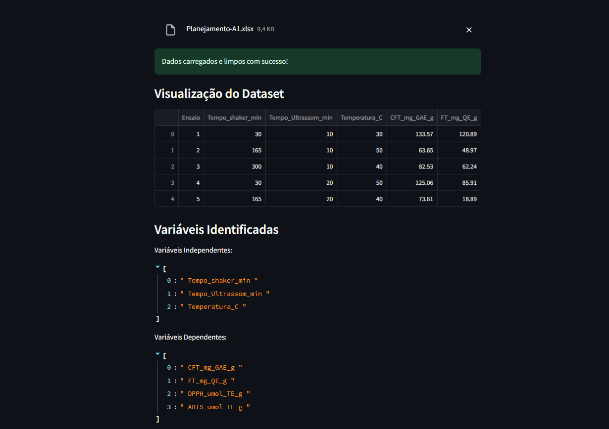

**Variáveis Identificadas:**

O sistema identificou automaticamente as seguintes variáveis para a análise:

* **Variáveis Independentes (Fatores):**
    * `Tempo_shaker_min`
    * `Tempo_Ultrassom_min`
    * `Temperatura_C`

* **Variáveis Dependentes (Respostas):**
    * `CFT_mg_GAE_g`
    * `FT_mg_QE_g`
    * `DPPH_umol_TE_g`
    * `ABTS_umol_TE_g`

## 🧠 Etapa 2: Orquestração e Análise Automatizada (Gráficos de Pareto Iniciais)

Com as variáveis identificadas, o agente LYRA prossegue para executar análises para cada variável dependente, começando pela visualização da significância dos fatores através dos Gráficos de Pareto.

### 2.1 Análise da Variável `ABTS_umol_TE_g`

Para a variável `ABTS_umol_TE_g`, o Gráfico de Pareto gerado mostrou que os fatores `Temperatura_C` e `Tempo_Ultrassom_min` são os mais significativos. No entanto, o coeficiente de determinação ($R^2$) para este modelo foi de **22,93%**, que é considerado baixo (abaixo de 50%).

**Diagnóstico do LYRA:** Devido ao baixo $R^2$ (`22,93% < 50%`), o processo de desejabilidade **não será executado** para esta variável, indicando que o modelo não possui capacidade preditiva suficiente.

### 2.2 Análise da Variável `CFT_mg_GAE_g`

Ao analisar a variável `CFT_mg_GAE_g`, o Gráfico de Pareto destacou diversos fatores significativos, incluindo termos de interação e quadráticos, além das variáveis principais `Temperatura_C`, `Tempo_Ultrassom_min` e `Tempo_shaker_min`. O $R^2$ para este modelo foi de **75,35%**, o que indica um bom ajuste.

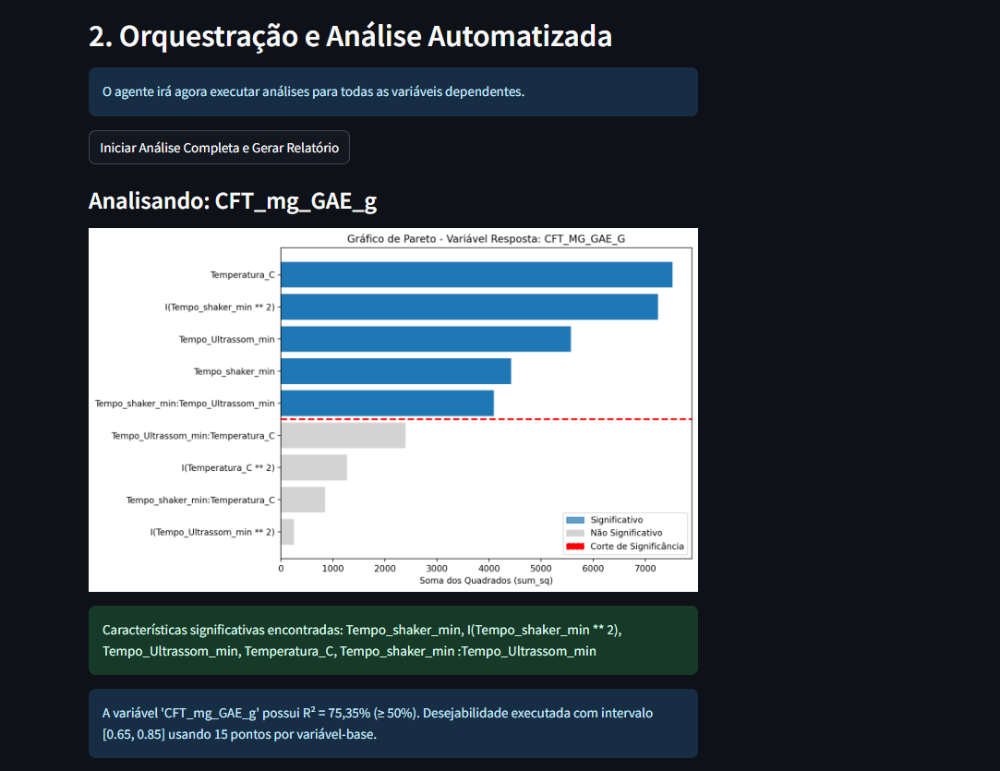

**Diagnóstico do LYRA:** Com um $R^2$ robusto (`75,35% >= 50%`), o processo de desejabilidade **será executado** para esta variável, buscando otimizar os resultados com base em um intervalo definido.

### 2.3 Análise da Variável `DPPH_umol_TE_g`

Para a variável `DPPH_umol_TE_g`, o Gráfico de Pareto mostrou `Temperatura_C` e `Tempo_Ultrassom_min` como as características mais proeminentes. No entanto, o $R^2$ obtido foi de **32,65%**, indicando uma baixa capacidade preditiva do modelo.

http://googleusercontent.com/image_generation_content/3

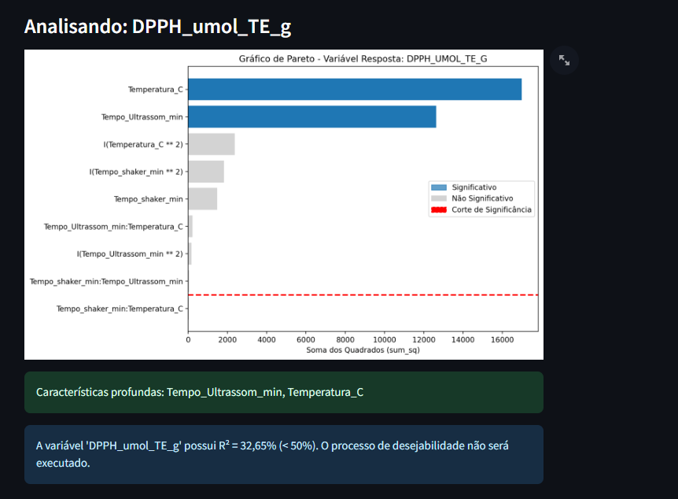

**Diagnóstico do LYRA:** Assim como na variável `ABTS_umol_TE_g`, o baixo $R^2$ (`32,65% < 50%`) levou ao **bloqueio da execução da desejabilidade** para `DPPH_umol_TE_g`.

### 2.4 Análise da Variável `FT_mg_QE_g`

A análise da variável `FT_mg_QE_g` também apresentou um $R^2$ muito baixo, de apenas **8,45%**. O Gráfico de Pareto indicou que, embora `Temperatura_C` e `Tempo_Ultrassom_min` tivessem alguma influência, a contribuição geral dos fatores para a variabilidade da resposta é mínima.

http://googleusercontent.com/image_generation_content/4

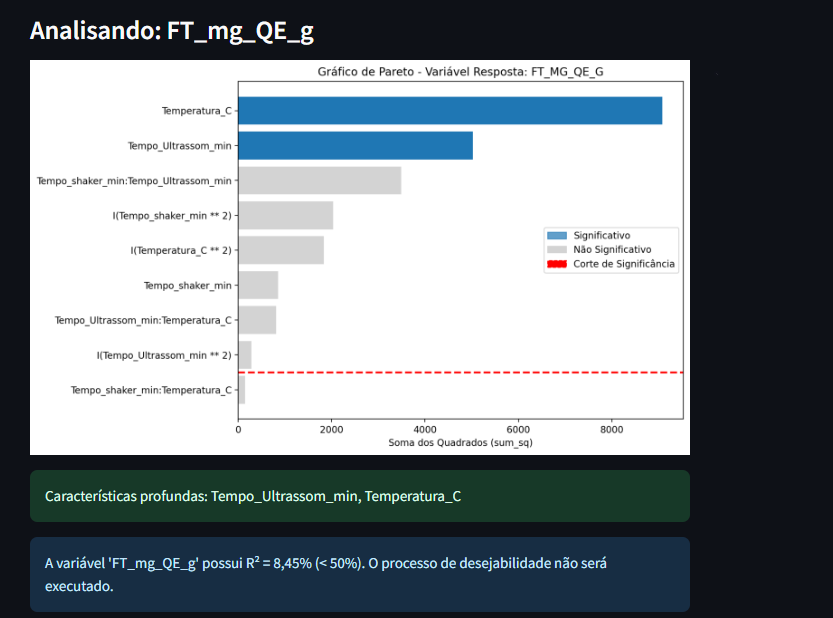
---

**Diagnóstico do LYRA:** Com um $R^2$ tão baixo (`8,45% < 50%`), o sistema identificou que o modelo é **incapaz de predizer adequadamente** a variável `FT_mg_QE_g`. Consequentemente, a desejabilidade **não será executada**, e uma revisão do planejamento experimental é recomendada para esta resposta.

---

Entendido! Você enviou todas as imagens restantes do **Planejamento A1**, que cobrem a **Análise de Variância (ANOVA)**, as **Métricas de Qualidade do Modelo**, as **Fórmulas** e a **Otimização por Desejabilidade** para a variável de sucesso (`CFT_mg_GAE_g`).

Vou continuar a construção do `README.md` a partir de onde paramos (após os Paretos).

---

## 🤖 Análise LYRA: Agente de IA (Projeto LYRA)

### 🧠 Etapa 3: Análise de Variância (ANOVA) e Qualidade do Modelo

A etapa seguinte envolve a execução da **Análise de Variância (ANOVA)** para cada variável e a avaliação das **Métricas de Qualidade do Modelo**.

### 3.1 Análise Detalhada das Variáveis com Baixo $R^2$ (Modelos Críticos)

Para as respostas com $R^2 < 50\%$ (`DPPH_umol_TE_g`, `ABTS_umol_TE_g` e `FT_mg_QE_g`), o LYRA emite diagnósticos de risco e bloqueia a otimização.

#### **A) Análise `DPPH_umol_TE_g` ($R^2 = 32.65\%$)**

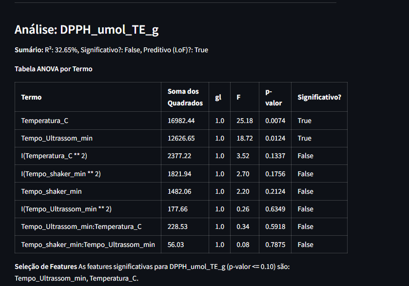

* **ANOVA:** Apenas `Temperatura_C` e `Tempo_Ultrassom_min` foram significativos.
* **Métricas:** O modelo é **Predicativo (`True`)**, mas **Não Significativo (`False`)**.
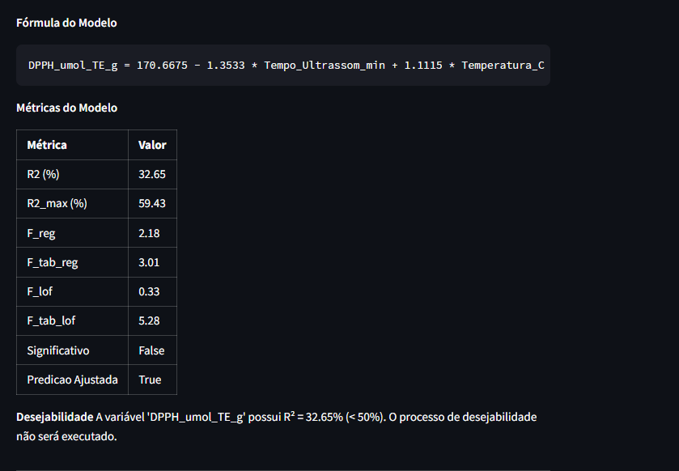

* **Ação do LYRA:** Devido ao baixo $R^2$, a **Desejabilidade não foi executada**, e o modelo final foi simplificado para:

${DPPH\_umol\_TE\_g} = 170,6675 - 1,3533 \times \text{Tempo\_Ultrassom\_min} + 1,1115 \times \text{Temperatura\_C}$

$\mathrm{DPPH\_umol\_TE\_g} = 170,6675 - 1,3533 \times \mathrm{Tempo\_Ultrassom\_min} + 1,1115 \times \mathrm{Temperatura\_C}$

$DPPH_{umol\_TE\_g} = 170,6675 - 1,3533 \times \text{Tempo}_{Ultrassom\_min} + 1,1115 \times \text{Temperatura}_{C}$

$DPPH\_\text{umol\_TE\_g} = 170,6675 - 1,3533 \times \text{Tempo\_Ultrassom\_min} + 1,1115 \times \text{Temperatura\_C}$

$DPPH\_\text{umol\_TE\_g} = 170{,}6675 - 1{,}3533 \times \text{Tempo\_Ultrassom\_min} + 1{,}1115 \times \text{Temperatura\_C}$

#### **B) Análise `ABTS_umol_TE_g` ($R^2 = 22.93\%$)**

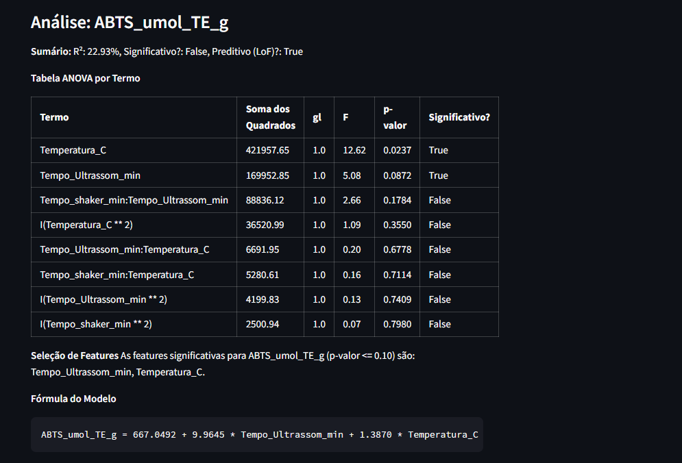

* **ANOVA:** Apenas `Temperatura_C` e `Tempo_Ultrassom_min` foram significativos.
* **Métricas:** O modelo é **Não Significativo (`False`)**.

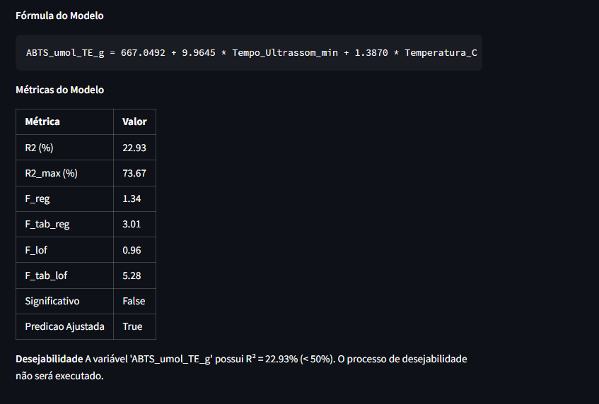

* **Ação do LYRA:** A **Desejabilidade não foi executada**. O modelo, apesar de ter baixo $R^2$, foi gerado como:
    $$\text{ABTS\_umol\_TE\_g} = 667.8492 + 9.9645 \times \text{Tempo\_Ultrassom\_min} + 1.3876 \times \text{Temperatura\_C}$$

#### **C) Análise `FT_mg_QE_g` ($R^2 = 8.45\%$)**

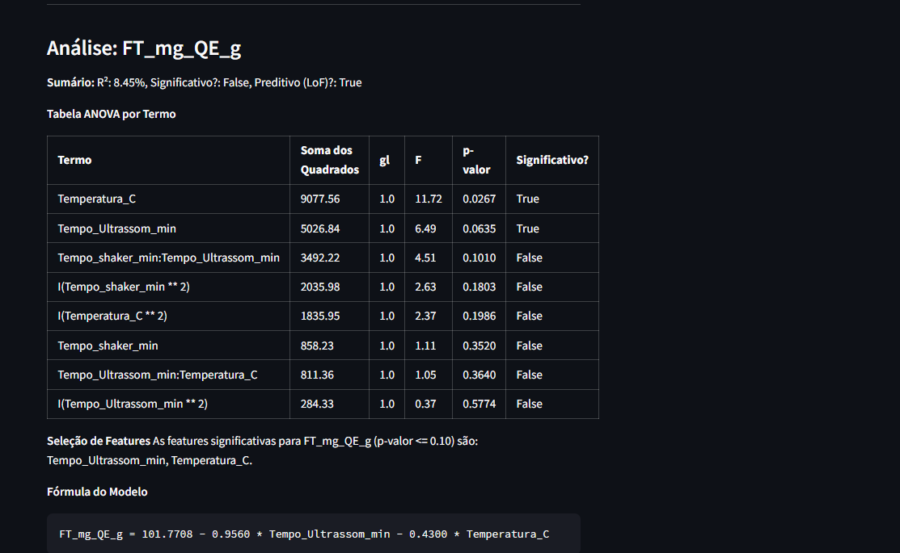

* **ANOVA:** Apenas `Temperatura_C` e `Tempo_Ultrassom_min` foram significativos.
* **Métricas:** O modelo é **Não Significativo (`False`)**.

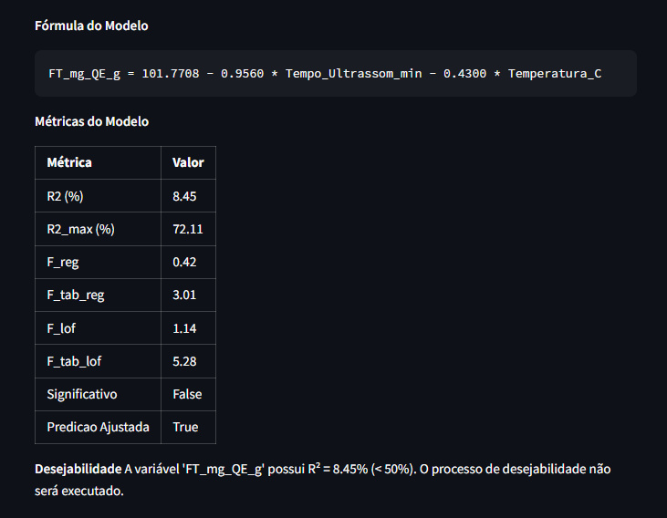

* **Ação do LYRA:** O sistema diagnosticou uma **Falha Crítica na Preditividade**, e a Desejabilidade foi bloqueada.

---

#### 3.2 Análise Detalhada da Variável `CFT_mg_GAE_g` (Modelo de Sucesso)

O LYRA priorizou a análise de `CFT_mg_GAE_g` devido ao seu **$R^2$ robusto de 75,35%**, indicando um alto poder de explicação e ajuste do modelo.

#### 📊 Tabela ANOVA por Termo

A ANOVA decompôs a variabilidade, confirmando a significância de diversos termos.

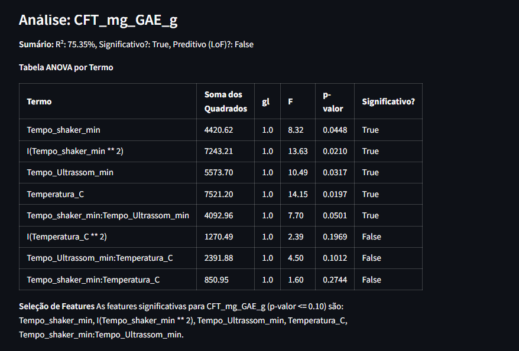

* **Seleção de Features:** Os termos significativos (p-valor $\leq 0.10$) identificados foram: `Tempo_shaker_min`, o termo quadrático `I(Tempo_shaker_min ** 2)`, `Tempo_Ultrassom_min`, `Temperatura_C` e o termo de interação `Tempo_shaker_min:Tempo_Ultrassom_min`.

#### 📈 Fórmula do Modelo Ajustado (Geração de Código)

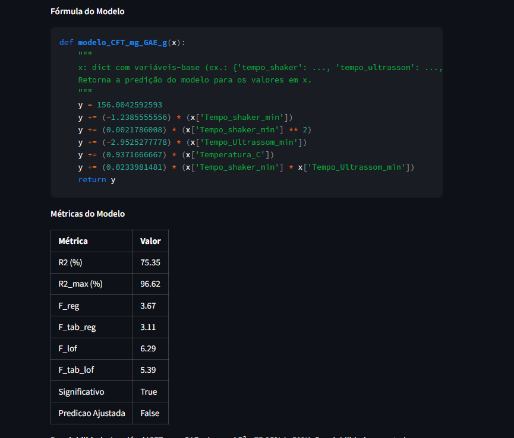

O Agente LYRA gerou a função em Python do modelo polinomial ajustado. Esta fórmula permite a **previsão** de novos valores de `CFT_mg_GAE_g` com base nas configurações de tempo e temperatura.

#### 📐 Métricas de Qualidade

As métricas confirmaram a validade preditiva do modelo global:

| Métrica | Valor | Interpretação |
| :--- | :--- | :--- |
| **R2 (%)** | **75.35** | Excelente capacidade de explicar a variabilidade dos dados. |
| **Significativo?** | **True** | O teste F global indica que o modelo tem poder preditivo real. |
| **Predição Ajustada (LoF)?** | **False** | **Alerta Crítico:** A **Falta de Ajuste (Lack-of-Fit)** falhou. O modelo é preditivo, mas as fontes de erro sugerem que ele pode não estar ajustado perfeitamente ao erro puro. O LYRA prossegue, mas sinaliza a necessidade de cautela. |

---

## 🎯 Etapa 4: Otimização e Desejabilidade Global (Apenas para `CFT_mg_GAE_g`)

Como apenas o modelo de `CFT_mg_GAE_g` atingiu um $R^2$ aceitável para a otimização, a etapa final do LYRA concentra-se em encontrar o ponto de operação ideal para esta resposta.

### 4.1 Tabela de Melhores Resultados

O LYRA executou o cálculo de **Desejabilidade Unidirecional** e gerou uma tabela com as 10 melhores combinações de fatores que resultam nos maiores índices de desejabilidade (próximos a 1.0).

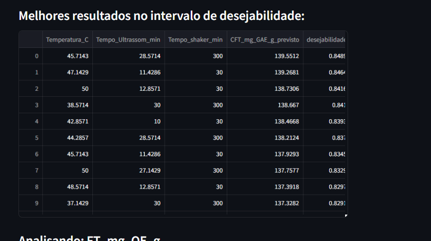

* **Melhor Desejabilidade:** O pico de desempenho atingido foi de **0.8489** (na linha 0 e 2).
* **Ponto Ótimo de Operação:** A melhor combinação prevê um valor de `CFT_mg_GAE_g` de **139.5512** com a seguinte configuração: $\text{Temperatura\_C} = 45.71^\circ\text{C}$, $\text{Tempo\_Ultrassom\_min} = 28.57$ min, e $\text{Tempo\_shaker\_min} = 300$ min.

### 4.2 Geração de Cenários Estratégicos (Interpretação da IA)

Com base na tabela de otimização, o Agente LYRA interpretou os dados e gerou **3 Cenários Estratégicos** de otimização para guiar a tomada de decisão do usuário:

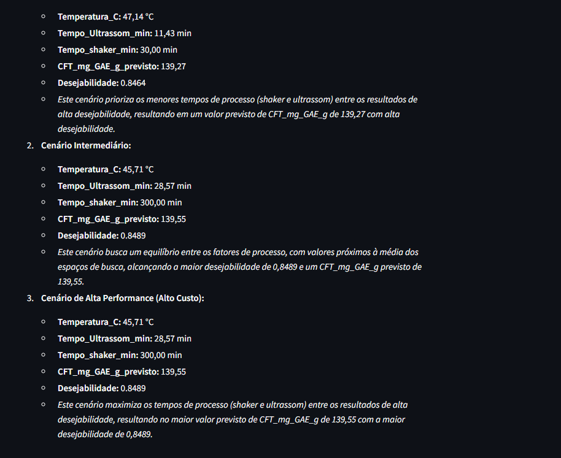

| Cenário | Foco Estratégico | Resultado Previsto |
| :--- | :--- | :--- |
| **1. Cenário Econômico** | Prioriza **menores tempos de processo** (menor custo de energia/operação) entre os resultados de alta desejabilidade. | $D=0.8464$, $\text{CFT}=139.27$ |
| **2. Cenário Intermediário** | Busca o **equilíbrio entre os fatores** (valores próximos à média do espaço de busca), atingindo a **Desejabilidade Máxima** no intervalo. | $D=0.8489$, $\text{CFT}=139.55$ |
| **3. Cenário de Alta Performance** | **Maximiza os tempos de processo** (shaker e ultrassom) para obter os resultados de alta desejabilidade. | $D=0.8489$, $\text{CFT}=139.55$ |

---

## ✅ Conclusão do Planejamento A1 pelo LYRA

O **Planejamento A1** foi classificado pelo LYRA como um **Cenário de Sucesso Parcial e Otimização Concentrada**:

* **Sucesso:** O modelo da variável `CFT_mg_GAE_g` demonstrou alto ajuste ($R^2 > 75\%$), permitindo a otimização completa e a identificação de um ponto ótimo de operação (Desejabilidade $\approx 0.85$).
* **Risco/Falha:** Os modelos das respostas `DPPH`, `ABTS` e `FT` falharam nos testes de qualidade preditiva ($R^2 < 50\%$), indicando que os fatores experimentais definidos (tempo e temperatura) **não foram suficientes para modelar ou explicar a variabilidade destas respostas**.

O relatório final e os três cenários estratégicos permitem que o pesquisador aplique a otimização de `CFT_mg_GAE_g` com confiança, enquanto o alerta sobre as demais respostas direciona a futuras revisões do planejamento experimental.

---
